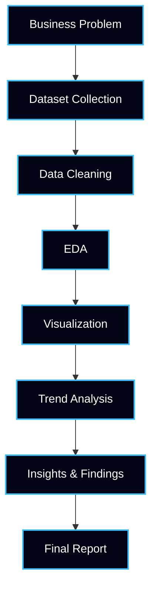
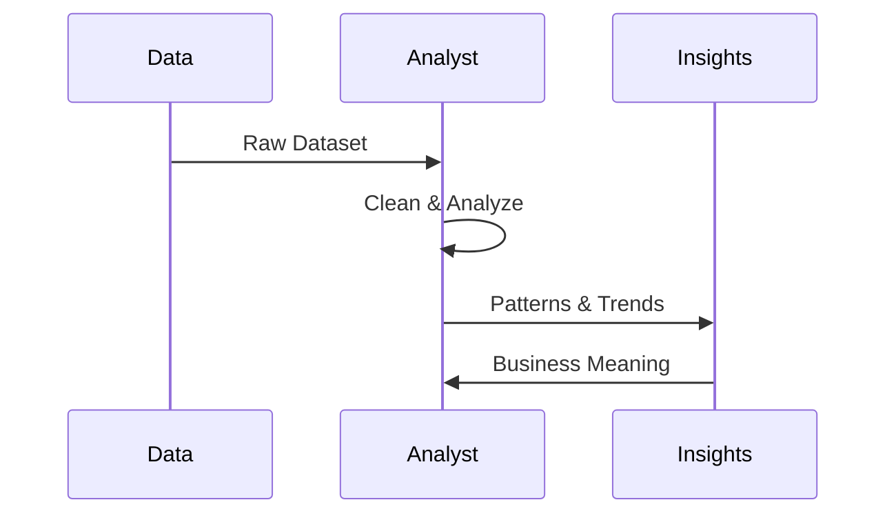

<!-- ========================================================= -->
<!-- ===== CODEC TECHNOLOGY – DATA ANALYST INTERNSHIP ========= -->
<!-- ========================================================= -->

<p align="center">
  
</p>

<h1 align="center">📊 Codec Technology – Data Analyst Internship Projects</h1>

<p align="center">
<b>AICTE-Recognized Industry-Oriented Data Analytics Internship</b><br>
Showcasing <b>data analysis, visualization, insights generation, and business intelligence workflows</b>
</p>

---

## 📁 Repository Overview

```txt
Internship Type   : Data Analyst (AICTE Internship)
Organization      : Codec Technology
Focus Area        : Data Analysis & Business Insights
Approach          : Hands-on | Project-Based | Industry-Oriented
Outcome           : Job-Ready Data Analyst Portfolio
````

This repository documents my **complete Data Analyst internship journey**, including:

* Real-world datasets
* Structured data analysis workflows
* Data cleaning → EDA → visualization → insights
* Professional reporting & documentation

---

## 🔥 Repository Metrics

<p align="center">


</p>

<p align="center">


</p>

---

## 🎯 Internship Objectives (Industry-Aligned)

* Perform **data collection & cleaning**
* Conduct **exploratory data analysis (EDA)**
* Create **meaningful visualizations**
* Identify **patterns, trends & anomalies**
* Translate data into **business insights**
* Develop **professional analytical documentation**

---

## 🧠 Data Analyst Skills Mapped to Industry Expectations

| Industry Requirement | Internship Skill                |
| -------------------- | ------------------------------- |
| Data Understanding   | Dataset Exploration & Profiling |
| Clean Data           | Data Cleaning & Preprocessing   |
| Insight Discovery    | Exploratory Data Analysis (EDA) |
| Visual Storytelling  | Charts & Dashboards             |
| Decision Support     | Insight Interpretation          |
| Team Readiness       | Structured Reports & Code       |

---

## 📦 Data Analysis Lifecycle



---

## 🧭 Internship Learning Roadmap


---

## 🧪 Typical Data Analyst Project Structure

```txt
📁 Project_Name/
│
├── 📄 problem_statement.md
├── 📊 dataset.csv
├── 📓 data_analysis.ipynb
├── 📈 visualizations.ipynb
├── 📋 insights.md
├── 📑 final_report.pdf
└── 📘 README.md
```

---

## 📊 Data Cleaning & Preparation

**Techniques Used**

* Handling missing values
* Removing duplicates
* Outlier detection
* Data type correction
* Feature transformation

```python
df.isnull().sum()
df.drop_duplicates(inplace=True)
df.fillna(method='ffill', inplace=True)
```

---

## 📈 Exploratory Data Analysis (EDA)



---

## 📊 Visualization Techniques Used

| Chart Type | Purpose                 |
| ---------- | ----------------------- |
| Bar Chart  | Category comparison     |
| Line Chart | Trend analysis          |
| Pie Chart  | Proportion distribution |
| Heatmap    | Correlation analysis    |
| Box Plot   | Outlier detection       |

---

## 🛠️ Tools & Technology Stack

| Tool       | Usage                     |
| ---------- | ------------------------- |
| Python     | Data Analysis             |
| Pandas     | Data Manipulation         |
| NumPy      | Numerical Operations      |
| Matplotlib | Visualization             |
| Seaborn    | Statistical Visualization |
| Excel      | Data Validation           |
| GitHub     | Version Control           |

---

## 🧑‍💻 Author

**Ashwin Ananta Panbude**
Data Analyst Intern | AI Intern | Faculty

<p align="center">
  <a href="https://github.com/Ashwin18-Offcl">
    
  </a>
  <a href="https://bit.ly/49pSuZJ">
    
  </a>
</p>

---

## 📝 Summary

This Data Analyst Internship repository demonstrates real-world data analysis skills including data cleaning, exploratory data analysis, visualization, trend identification, and insight generation. The projects reflect industry-ready analytical thinking, business understanding, and professional reporting standards aligned with AICTE internship guidelines.

